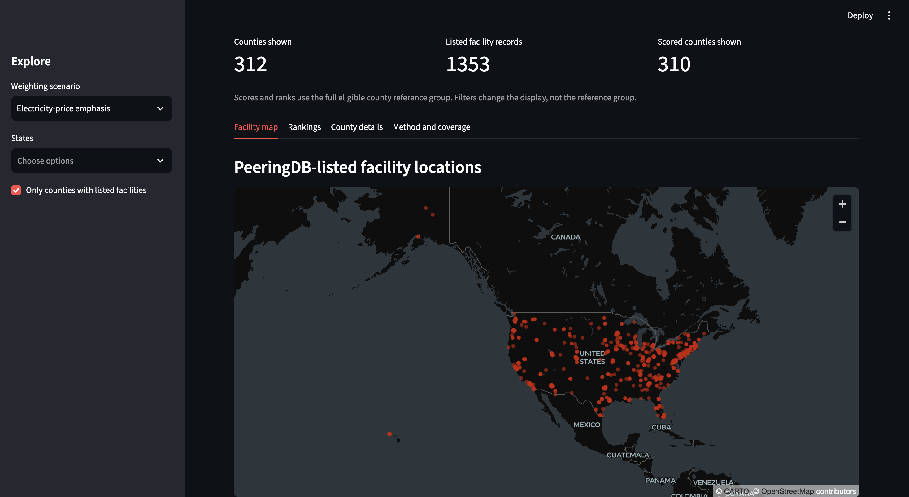

</> Markdown

# AI Infrastructure Burden Index

## Project overview
Investigating how data-center infrastructure overlaps with
electricity costs, water stress and socioeconomic vulnerability
across the United States.

## First version
- Map data-center locations.
- Compare electricity prices, water stress and community vulnerability.
- Construct a transparent preliminary burden index.
- Build an interactive dashboard.

## Research limitations
The preliminary index measures exposure and vulnerability.
It does not establish that data centers caused higher costs
or environmental harm.

## Current stage
Local dashboard complete. Data preparation, spatial matching,
draft screening scores and weighting sensitivity checks completed.
Electricity-source verification and publication remain outstanding.

